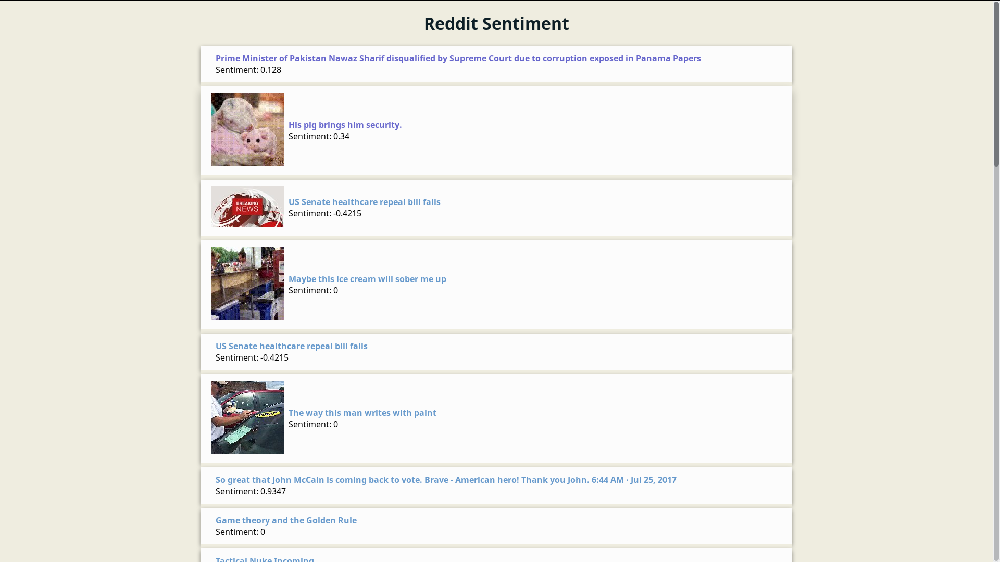

# General overview

Reddit sentiment is a simple webapp that displays the latest threads from [reddit's frontpage](https://reddit.com/r/all/) after processing the title and assigning a float value to it, which indicates whether it's positive or negative and how strong is perceived, with negative values meaning negative sentiments and the other way around.




# Technical overview

The project is structured in three different modules. `rs-data`, `rs-back` and `rs-front`. There is more detail in each project's README.

* [rs-data](https://gitlab.com/reddit-mining/rs-data) fetches the frontpage using an oauth handshake and stores the data in MongoDB after processing it with VADER's utilities.
* [rs-back](https://gitlab.com/reddit-mining/rs-back) simple spring boot that exposes a REST endpoint with the necessary data.
* [rs-front](https://gitlab.com/reddit-mining/rs-front) angular project that consumes data from rs-back.


# Running the application

### Pre-requisites

- `node >= 6.11`
- `java SDK >= 1.8`, `maven >= 3.3`
- `python >= 3.5`, `pip`

### Installation

```bash
git clone --recursive https://gitlab.com/reddit-mining/reddit-sentiment.git


cd rs-data; pip3 install -r requirements
cd ../rs-back; mvn clean install
cd ../rs-front; npm install

```

You also need to create the file holding oauth keys in `rs-data/src/rauth/` dir. This is an example of how it needs to be structured:
```
app ID
app secret
username
user password
```

In order to get app credentials you need to create one [here](https://www.reddit.com/prefs/apps/). Username and user password are your reddit user account credentials. If you don't have an account you can quickly create one using one of those temporary mail services (less than 10 seconds setup if you're quick with the keyboard).

### Run

After this you're good to go. Application is not packaged for production use, so it does feel clunky to run.

`rs-data` module is ran calling `core.py`. Either run as `./core.py` or call `python3 core.py`. `rs-back` is easily packaged by maven, so just look for the `backend-0.0.1-SNAPSHOT.jar` jar in /target. The angular front end uses angular cli, so you can just call the `ng serve` command for a quick test.

-----

### Attributions

Webapp gitlab group icon: https://goo.gl/4QRJmh